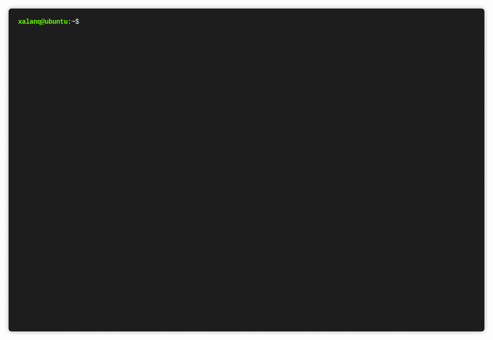

# Codeforces Tool

[](https://github.com/xalanq/cf-tool/releases)
[](https://github.com/xalanq/cf-tool/releases)
[](https://travis-ci.org/xalanq/cf-tool)
[](https://goreportcard.com/report/github.com/xalanq/cf-tool)
[](https://github.com/golang)
[](https://raw.githubusercontent.com/xalanq/cf-tool/master/LICENSE)

Codeforces Tool 是 [Codeforces](https://codeforces.com) 的命令行界面的工具。

这玩意儿挺快、挺小、挺强大，还跨平台哦。

[安装](#安装) | [使用方法](#使用方法) | [常见问题](#常见问题) | [English](./README.md)

## 特点

* 支持 Codeforces 中的所有编程语言
* 支持 contests 和 gym
* 提交代码
* 动态刷新提交后的情况
* 拉取问题的样例
* 本地编译和测试样例
* 拉取某人的所有代码
* 从指定模板生成代码（包括时间戳，作者等信息）
* 列出某场比赛的所有题目的整体信息
* 用默认的网页浏览器打开题目页面、榜单、提交页面等
* 设置网络代理
* 丰富多彩的命令行

欢迎大家一起完善这个工具呀，欢迎Pull requests。



## 安装

你可以从[这里](https://github.com/xalanq/cf-tool/releases)直接下载一个可执行文件，直接用就好啦。

或者你可以把整个 repo 给 clone 下来，然后自己编译 (go >= 1.12)：

```plain
$ go get github.com/xalanq/cf-tool
$ cd $GOPATH/src/github.com/xalanq/cf-tool
$ go build -ldflags "-s -w" cf.go
```

如果你不知道 `$GOPATH` 是什么，请看一下这篇文章 <https://github.com/golang/go/wiki/GOPATH>.

## 使用方法

以下简单模拟一场比赛的流程。

 `cf race 1136` 

要开始打 1136 这场比赛了！其中 1136 可以从比赛的链接获取，比方说这个例子的比赛链接就为<https://codeforces.com/contest/1136>。

如果比赛还未开始，则该命令会进行倒计时。比赛已开始或倒计时完后，工具会自动用默认浏览器打开比赛的题目界面与所有题目页面，并拉取样例到本地。

 `cd 1136/a` 

进入 A 题的目录，此时该目录下会包含该题的样例。

 `cf gen` 

用默认模板生成一份代码，代码文件名默认是题目的 ID。

 `vim a.cpp` 

用 Vim 写代码（这取决于你）。

 `cf test` 

编译并测试样例。

 `cf submit` 

提交代码。

 `cf list` 

查看当前比赛各个题目的信息。

 `cf stand` 

用浏览器打开榜单，查看排名。

```plain
首先你得用 "cf config" 命令来配置一下用户名、密码和代码模板

如果你想用本工具打比赛，那么最好用 "cf race 1111" 命令，其中 "1111" 是比赛的 id

支持的命令:
  cf config
  cf submit [(<contest-id> <problem-id>)] [<filename>]
  cf list [<contest-id>]
  cf parse [<contest-id>] [<problem-id>]
  cf gen [<alias>]
  cf test [<filename>]
  cf watch [all] [<contest-id>] [<problem-id>]
  cf open [<contest-id>] [<problem-id>]
  cf stand [<contest-id>]
  cf sid [<submission-id>] [<contest-id>]
  cf race <contest-id>
  cf pull [ac] [<contest-id>] [<problem-id>]
  cf clone [ac] <handle>
  cf upgrade

例子:
  cf config            配置 cf-tool。
  cf submit            如果当前路径是 "<contest-id>/<problem-id>" 那 cf 会找到匹配某个模板的代码，
                       然后提交到 <contest-id> 这场比赛的 <problem-id> 题目。
  cf submit a.cpp
  cf submit 100 a
  cf submit 100 a a.cpp
  cf list              列出当前比赛的题目通过、时限等信息。
  cf list 1119         
  cf parse 100         获取比赛 id 为 100 的所有题目的样例到文件夹 "./100/<problem-id>" 下。
  cf parse 100 a       获取比赛 id 为 100 的题目 a 的样例到文件夹 "./100/a" 下。
  cf parse             获取当前比赛的当前题目到当前文件夹下。
  cf gen               用默认的模板生成一份代码到当前文件夹下。
  cf gen cpp           用名字为 "cpp" 的模板来生成一份代码到当前文件夹下。
  cf test              在当前目录下执行模板里的命令，并测试全部样例。如果你想加一组新的测试数据，
                       新建两个文件 "inK.txt" 和 "ansK.txt" 即可，其中 K 是包含 0~9 的字符串。
  cf watch             查看自己在当前比赛的最后 10 次提交结果。
  cf watch all         查看自己在当前比赛的全部提交结果
  cf open 1136 a       用默认的浏览器打开比赛 id 为 1136 的题目 a。
  cf open 1136         用默认的浏览器打开比赛 id 为 1136 的总览页面。
  cf stand             用默认的浏览器打开当前比赛的榜单。
  cf sid 52531875      用默认的浏览器打开 52531875 这个提交页面。
  cf sid               打开最后一次提交的页面。
  cf race 1136         如果比赛还未开始且进入倒计时，则该命令会倒计时。倒计时完后，会自动打开一些
                       题目页面并拉取样例。
  cf pull 100          拉取比赛 id 为 100 每道题的最新代码到文件夹 "./100/<problem-id>" 下。
  cf pull 100 a        拉取比赛 id 为 100 的题目 a 的最新代码到文件夹 "./100/a" 下。
  cf pull ac 100 a     拉取比赛 id 为 100 的题目 a 的 AC 代码。
  cf pull              拉取当前题目的最新代码到当前文件夹下。
  cf clone xalanq      拉取 xalanq 的所有提交代码。
  cf upgrade           从 GitHub 更新 "cf" 到最新版。

注意:
  <problem-id>         表示题目的 id，比如 "a" 或者 "A"，不区分大小写。
  <contest-id>         表示比赛 id，你可以从比赛链接找到。比如 "https://codeforces.com/contest/1119"
                       这个链接就是 id 为 "1119" 的比赛。
  <alias>              模板的名字。

储存的文件:
  cf 会保存数据到以下文件：

  "~/.cf/config"        这是配置文件。
  "~/.cf/session"       这是会话文件，包括 cookies、用户名、密码等。

  "~" 这个符号是系统当前用户的主文件夹。

模板:
  你可以在你的代码里插入一些标识符，当用 cf 生成代码的时候，标识符会按照以下规则替换：

  $%U%$   用户名 (例如 xalanq)
  $%Y%$   年  (例如 2019)
  $%M%$   月  (例如 04)
  $%D%$   日  (例如 09)
  $%h%$   时  (例如 08)
  $%m%$   分  (例如 05)
  $%s%$   秒  (例如 00)

模板内的脚本:
  模板支持三个脚本命令，当使用 "cf test" 时会依次执行：
    - before_script   (只会执行一次)
    - script          (有多少个样例就会执行多少次)
    - after_script    (只会执行一次)
  "before_script" 或者 "after_script" 你可以根据需要来设置，也可以设置为空。
  在 "script" 里你必须要运行你的程序，通过标准 IO 来输入/输出数据（不用重定向）。

  你在这些脚本命令里也能插入一些标识符，这些标识符会按照以下规则替换：
  
  $%path%$   代码的路径 (不包括 $%full%$， 比如 "/home/xalanq/")
  $%full%$   代码的文件名 (比如 "a.cpp")
  $%file%$   代码的文件名 (不包括后缀，比如 "a")
  $%rand%$   一个长度为 8 的随机字符串 (只包括 "a-z" "0-9" 范围内的字符)

Options:
  -h --help
  --version
```

## 模板例子

当这份模板被 `cf gen` 生成时，模板内部的占位符会替换成相应的内容。

```
$%U%$   用户名 (例如 xalanq)
$%Y%$   年  (例如 2019)
$%M%$   月  (例如 04)
$%D%$   日  (例如 09)
$%h%$   时  (例如 08)
$%m%$   分  (例如 05)
$%s%$   秒  (例如 00)
```

```cpp
/* Generated by powerful Codeforces Tool
 * You can download the binary file in here https://github.com/xalanq/cf-tool (win, macOS, linux)
 * Author: $%U%$
 * Time: $%Y%$-$%M%$-$%D%$ $%h%$:$%m%$:$%s%$
**/

#include <bits/stdc++.h>
using namespace std;

typedef long long ll;

int main() {
    ios::sync_with_stdio(false);
    cin.tie(0);
    
    return 0;
}
```

## 常见问题

### 我双击了这个程序但是没啥效果

Codeforces Tool 是命令行界面的工具，你应该在终端里运行这个工具。

### 我无法使用 `cf` 这个命令

你应该将 `cf` 这个程序放到一个已经加入到系统变量 PATH 的路径里 (比如说 Linux 里的 `/usr/bin/` )。

或者你直接去搜 "怎样添加路径到系统变量 PATH"。

### 如何加一个新的测试数据

新建两个额外的测试数据文件 `inK.txt` 和 `ansK.txt` （K 是包含 0~9 的字符串）。

### 在终端里启用 tab 补全命令

使用这个工具 [Infinidat/infi.docopt_completion](https://github.com/Infinidat/infi.docopt_completion) 即可。

注意：如果有一个新版本发布（尤其是添加了新命令），你应该重新运行 `docopt-completion cf`。
